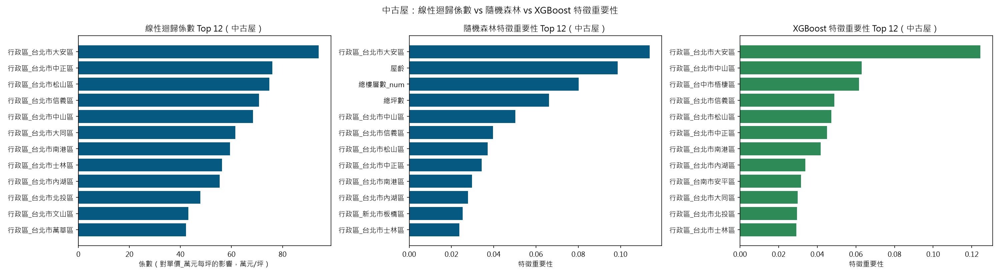
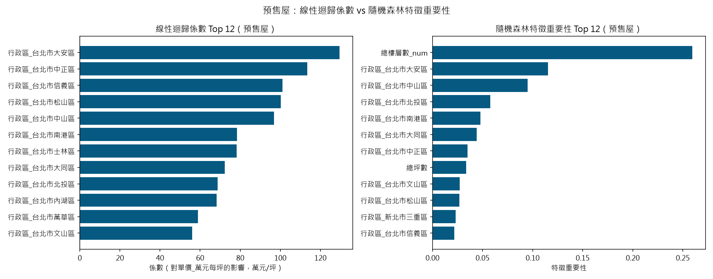
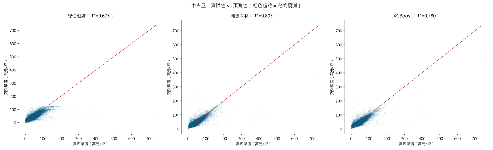
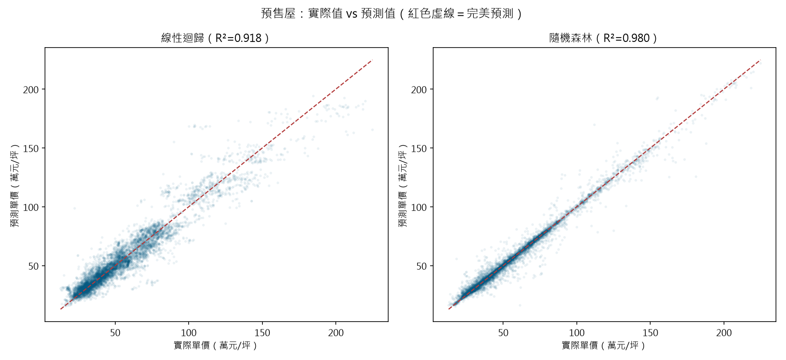

# 線性迴歸 vs 隨機森林 vs XGBoost：模型比較報告

資料範圍：全國 22 縣市，v2 完整特徵集（地區、車位、季度、坪數、建物型態、格局、樓層資訊；
中古屋額外加入屋齡，預售屋因屋齡結構性全缺而不採用）。以下為「公平對照」——
三個模型使用完全相同的特徵集，各自套用其正式定案的超參數設定。

## 1. 公平對照表

| 房屋類型 | 模型 | 測試 R² | RMSE | MAE |
|---|---|---|---|---|
| 中古屋 | 線性迴歸 | 0.597 | 14.45 | 7.34 |
| 中古屋 | 隨機森林（調參後，min_samples_leaf=5） | 0.740 | 11.61 | 4.63 |
| 中古屋 | XGBoost（調參後） | 0.731 | 11.82 | 6.08 |
| 預售屋 | 線性迴歸 | 0.918 | 8.58 | 5.81 |
| 預售屋 | 隨機森林（原設定） | 0.980 | 4.20 | 2.12 |
| 預售屋 | XGBoost（調參後） | 0.978 | 4.48 | 2.60 |

（完整資料另存於 [report_fair_comparison.csv](report_fair_comparison.csv)）

## 2. XGBoost 超參數調整歷程

XGBoost 的調參不是一次到位（完整程式碼見
[regression_xgboost.py](regression_xgboost.py)）：

1. **窄範圍搜尋**（`n_estimators`∈{100,200,300}、`max_depth`∈{3,4,5,6}、`learning_rate`∈{0.05,0.1,0.2}、
   `subsample`/`colsample_bytree`∈{0.6,0.8,1.0}、`min_child_weight`∈{1,3,5,10}，
   `RandomizedSearchCV`、`n_iter=10`、`cv=3`）：中古屋測試 R²=0.740、差距 0.044；
   預售屋測試 R²=0.968、差距 0.008。兩者都通過 ≤0.1 的過擬合門檻，看起來很順利。

2. **擴大搜尋範圍**（`n_estimators`加入 500、`max_depth`加入 8、`learning_rate`加入 0.01，其餘不變）之後，
   中古屋測試 R² 反而掉到 0.705，訓練/測試差距暴增到 0.167，觸發過擬合警訊；預售屋則沒事
   （0.967、差距 0.010）。搜出來的中古屋贏家參數是 `max_depth=8`、`min_child_weight=1`、
   `subsample=0.6`——樹更深、正則化更弱、抽樣隨機性更大，剛好是最容易過擬合的方向。

3. **把 `n_iter` 從 10 加到 20**，範圍不變，中古屋的結果完全沒變——因為 `random_state=42` 固定，
   前 10 組抽樣序列跟上次相同，多抽的 10 組沒有一組贏過原本那組候選的交叉驗證分數，證明問題不在
   「抽太少」，是選贏家的規則本身有問題。預售屋這邊倒是找到更好的組合（測試 R²=0.978、差距 0.015）。

4. **改變選贏家的規則**：不再直接用 `RandomizedSearchCV.best_params_`（單純看交叉驗證平均測試分數），
   改成加上 `return_train_score=True`，從 `cv_results_` 算出每組候選「交叉驗證訓練分數－測試分數」，
   篩選出差距 ≤0.1 的候選，再從中挑測試分數最高的一組。套用這個規則後，中古屋選出
   `max_depth=5`、`min_child_weight=10`、`subsample=1.0` 這組，測試 R²=0.731、
   差距 0.045——過擬合問題解決，代價是比原本被交叉驗證選中的贏家
   （測試R²=0.705）低了一點點；預售屋維持第 3 步找到的組合不變（它本來就滿足新規則），
   測試 R²=0.978、差距 0.015。

**這個過程暴露的重點發現**：`RandomizedSearchCV` 預設用交叉驗證平均測試分數選贏家，這個分數只看
「準不準」，不看「訓練分數跟測試分數差多少」。一組參數可以在交叉驗證的平均測試分數上表現不錯，
同時訓練分數又特別高（代表它在記憶訓練資料），這種組合的平均分數可能剛好贏過其他組，卻是用過擬合
換來的分數，實際泛化能力並不可靠。要避免選到這種解，篩選規則必須把「差距」也當成篩選條件，
不能只看單一分數排名。

## 3. 特徵影響力：線性迴歸係數 vs 隨機森林 vs XGBoost 特徵重要性

線性迴歸的係數圖呈現「方向 + 大小」：藍色代表正向影響（該特徵值越大/該類別存在時，單價越高），
紅色代表負向影響。要留意的是，`行政區` 這類高基數類別經過 One-Hot 展開後彼此高度共線，
個別係數的精確數值會不穩定，解讀時應著重「方向」與「相對排序」，不宜當成嚴謹的邊際效應估計。
隨機森林與 XGBoost 的特徵重要性則不分方向，只呈現「這個特徵對降低預測誤差的貢獻有多大」——
但兩者算重要性的方式不同（隨機森林用不純度下降量，XGBoost 預設用分裂增益），排序不必然一致：
以中古屋為例，隨機森林的 Top 12 混了屋齡、總樓層數、總坪數三個數值特徵，XGBoost 的 Top 12
卻清一色是行政區類別，數值特徵完全沒擠進榜單。這不代表 XGBoost 忽略了屋齡或坪數的訊號
（兩者測試 R² 很接近就是反證），只是這兩種重要性指標本來就不是同一把尺，不宜直接拿排序做比較。

## 4. 實際值 vs 預測值

紅色虛線是完美預測（預測值=實際值）。隨機森林、XGBoost 的點都明顯比線性迴歸更貼近對角線，
線性迴歸的點在單價偏高的區間（豪宅、特殊地段）系統性地偏離對角線下方——代表線性迴歸低估了
高價物件。隨機森林與 XGBoost 兩者的散佈圖非常接近，肉眼較難分辨優劣，數字上的差異要看表格。

## 5. 線性迴歸的預測範圍問題：可能出現不合理負值

實際檢查中古屋線性迴歸模型在測試集上的預測值（`lr_pred`），發現有 **12 筆／共 41351 筆
（0.0290%）預測出負的單價**——但「單價_萬元每坪」在真實世界裡不可能是負數，這是模型的明顯瑕疵。

同一份測試集上，隨機森林的預測值範圍是 **[4.44, 313.98]**，
對照訓練集實際觀察到的單價範圍 **[0.00, 1763.90]**，隨機森林沒有任何一筆負值。

這不是巧合，而是兩種模型的機制差異所致：

- **線性迴歸擬合的是一個沒有邊界的超平面**：`預測值 = 截距 + Σ(係數 × 特徵值)`。當某筆資料的特徵組合
  落在訓練資料較稀疏、或多個負向係數的類別疊加在一起時（例如低價地區 × 高屋齡 × 小坪數的組合），
  加總結果可以跌到 0 以下。線性迴歸完全不知道「單價不能是負的」這個常識，因為這個限制從未寫進模型裡。

- **隨機森林的預測值必然落在訓練資料的觀察範圍內**：每一棵樹的預測是某個葉節點裡「實際訓練樣本的
  平均值」，森林的最終預測再對這些樹取平均。既然平均值不可能超出被平均的那些數字的範圍，
  隨機森林的預測天生就被訓練資料夾在 [0.00, 1763.90] 之間，不會外插到不合理的負值，
  但代價是它也無法預測出訓練資料範圍以外的極端值（例如史上最高單價的物件）。

## 6. 結論：為什麼隨機森林表現較好

中古屋測試 R² 從線性迴歸的 0.597 提升到隨機森林的 0.740，
預售屋從 0.918 提升到 0.980。差異的根源在於兩個模型對「特徵如何影響房價」
的假設不同：

- **線性迴歸假設每個特徵對房價的影響是一條直線、而且彼此獨立**。例如它認為「每增加一坪」對單價的
  加成是固定的，不管房子在哪個行政區、屋齡多大；也假設地區的影響和坪數的影響可以直接相加，
  不會互相干擾。但真實房價明顯不是這樣：市中心蛋黃區的坪數溢價，跟郊區的坪數溢價幅度完全不同
  （這是「特徵交互作用」）；屋齡對房價的影響也不是等速遞減，屋齡 0~10 年的跌價速度，
  跟屋齡 30~40 年的老屋通常不一樣（這是「非線性關係」）。這些線性迴歸都學不到。

- **隨機森林用一堆決策樹分裂資料**，每一次分裂都可以先看地區、再看坪數、再看屋齡，天生就能表達
  「在信義區，坪數的影響比較大」這種交互作用，也能表達「屋齡在某個轉折點後跌價速度變快」這種
  非線性曲線，而不需要事先假設任何函數形式。

也因為如此，這個比較不只是「哪個模型數字比較漂亮」，而是反映了房價本身的資料生成機制：
地區、屋況、格局之間彼此牽動、影響幅度隨情境而變——這正是樹模型的強項，也是線性迴歸的天生限制。

那 XGBoost 呢？同樣是樹模型，理論上該有跟隨機森林差不多的能力抓非線性關係與特徵交互作用，
實際結果也確實如此：兩個房屋類型，調參後的 XGBoost（中古屋 0.731、
預售屋 0.978）都只些微落後隨機森林（中古屋 0.740、
預售屋 0.980），差距都在 0.01 左右，不是量級上的差距。這說明當初把隨機森林
定為正式模型是合理的判斷——不是因為 XGBoost 不好，而是在這份資料、這組特徵下，兩種樹模型的
表現本來就非常接近，隨機森林剛好略勝一籌，且已經完成過擬合檢查與調參，沒有必要為了微小差距
再引入一個新的模型依賴。
